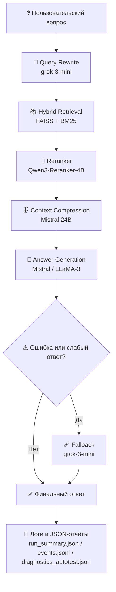

# AI_for_Finance
Ассистента на основе RAG отвечающий на открытые финансовые вопросы
# 🧠 Hybrid RAG + Reranker + Budget Guard + Autotest  
**Решение для AI-for-Finance Hackathon**  
Баланс качества, скорости, стоимости и стабильности в одном пайплайне.

✅ Hybrid RAG (FAISS + BM25)  
✅ Query rewrite + Context compression  
✅ Reranker (Qwen3-Reranker-4B)  
✅ Self-judge autotest  
✅ Token & cost budget guard  
✅ Fail-safe fallback  
✅ Режимы: `eco` / `balanced` / `max-score`  
✅ Полная совместимость с baseline API  

---

## 📁 Структура проекта

| Файл | Назначение |
|------|------------|
| `main.py` | Основной скрипт пайплайна |
| `requirements.txt` | Зависимости Python |
| `run_summary.json` | Итоговая статистика: токены, стоимость, время |
| `test_pipeline.py` | отладочные тесты |

---

## 🎯 Общее описание

**production-ready RAG-решение** для генерации точных, экономичных и стабильных ответов на финансовые вопросы. Пайплайн:

- извлекает релевантные фрагменты из локальной базы знаний (`train_data.csv`);
- использует **гибридный поиск** (векторный + текстовый);
- **переформулирует запрос** для повышения полноты;
- **ранжирует** найденные фрагменты с помощью внешнего **reranker'а**;
- **сжимает контекст** для снижения стоимости генерации;
- генерирует ответ с учётом **бюджета токенов**;
- при ошибках или превышении бюджета переключается на **экономичный fallback**;
- после основного прогона **автоматически оценивает качество** через autotest.

---

## 🧩 Архитектурная схема пайплайна

```
Вопрос → Query Rewrite → Hybrid Retrieve (FAISS + BM25)
                          ↓
                       Reranker (Qwen3-4B)
                          ↓
                    Top-K фрагментов (K=6)
                          ↓
                   Context Compression (Mistral)
                          ↓
                 Safe LLM Generation (Mistral / LLaMA)
                          ↓
                      Ответ → submission.csv
                          ↓
                  Autotest (Self-Judge) → diagnostics_autotest.json
```

> Все компоненты логируются в `logs/events.jsonl` для последующего анализа.

## 🔄 Retrieval-Augmented Generation (RAG) Диаграмма пайплайна



---

## 🛠️ Режимы работы

Поведение пайплайна управляется переменной `RAG_MODE`.

| Режим | Когда использовать | Модель | Стоимость | Детали |
|-------|--------------------|--------|-----------|--------|
| `eco` | Быстрая проверка, отладка | Grok-mini | 💸 | Максимальная экономия, минимальное качество |
| `balanced` (по умолчанию) | Основной запуск | Mistral-24B | 💸💸 | Оптимальный баланс |
| `max-score` | Финальный прогон | LLaMA-3-70B | 💸💸💸💸 | Максимальная точность |

> Переход между режимами меняет: модель генерации, число чанков, использование компрессии и лимиты токенов.

---

## 🧠 Компоненты пайплайна (техническое описание)

### 1. **Загрузка и чанкинг базы знаний**
- Источник: `train_data.csv`
- Каждый документ разбивается на чанки по **450 символов** с **overlap 50**.
- Используется `RecursiveCharacterTextSplitter`.

### 2. **FAISS + BM25: гибридный ретривер**
- **FAISS**: векторный поиск через `text-embedding-3-small`.
- **BM25**: TF-IDF на основе ключевых слов.
- Результаты объединяются, дубликаты удаляются → до **12 кандидатов**.

### 3. **Query Rewrite**
- Вопрос переформулируется в **2 альтернативные версии** через `grok-3-mini`.
- Улучшает полноту поиска за счёт семантического разнообразия.

### 4. **Reranker (Qwen3-Reranker-4B)**
- Внешний сервис: `https://ai-for-finance-hack.up.railway.app/rerank`
- Принимает вопрос + до 12 фрагментов → возвращает `relevance_score`.
- Лучшие **6 фрагментов** передаются в генерацию.
- При ошибке: пайплайн продолжает работу без reranker'а.

### 5. **Context Compression**
- Объединяет топ-4 фрагмента.
- Сжимает до **6 предложений** через `Mistral-24B`.
- Цель: снизить длину контекста → снизить стоимость.

### 6. **Safe Generation с Budget Guard**
- Функция `safe_generate()`:
  - Считает вход/выход токены через `tiktoken`.
  - Оценивает стоимость (`$0.20 / 1M input`, `$0.20 / 1M output`).
  - При превышении `DAILY_BUDGET_USD` → **автоматический fallback** в `eco`-режим.
- Вызывает модель, соответствующую текущему режиму.

### 7. **Fail-safe Fallback**
- Активируется при:
  - Ошибках API
  - Отсутствии релевантных фрагментов
  - Превышении бюджета
- Генерирует ответ через **дешёвую модель `grok-3-mini`**.

### 8. **Autotest (Self-Judge)**
- После основного прогона запускается `run_autotest()`.
- Прогоняет **3 контрольных вопроса**.
- Сравнивает:
  - Основной ответ vs `eco`-fallback
  - Косинусное сходство эмбеддингов (`text-embedding-3-small`)
  - Длину ответов и время генерации
- Результаты сохраняются в `diagnostics_autotest.json`.

---

## ⚙️ Управление через переменные окружения (`.env`)

| Переменная | Назначение | Значение по умолчанию |
|-----------|------------|------------------------|
| `LLM_API_KEY` | Ключ для LLM-инференса | — |
| `EMBEDDER_API_KEY` | Ключ для эмбеддингов | — |
| `RAG_MODE` | Режим работы | `balanced` |
| `USE_MOCK` | Включить мок-режим (без API) | `0` |
| `USE_RERANKER` | Активировать reranker | `1` |
| `DAILY_BUDGET_USD` | Лимит стоимости | `3.0` |
| `LOG_MODE` | Уровень логирования | `hackathon` |
| `BASE_URL` | Базовый URL LLM API | `https://ai-for-finance-hack.up.railway.app/` |
| `RERANKER_URL` | URL reranker API | `https://ai-for-finance-hack.up.railway.app/rerank` |

> Пример запуска:  
> ```bash
> RAG_MODE=eco LOG_MODE=trace python main.py
> ```

---

## 🗄️ FAISS Cache — ускорение без потери совместимости

- При первом запуске создаётся `faiss_index/` (включает `index.faiss` и `index.pkl`).
- При последующих запусках индекс **загружается мгновенно**, без повторных вызовов эмбеддингов.
- **Не нарушает baseline**: поведение одинаково при первом и последующих запусках.
- Поддержка:
  - `USE_MOCK=1` → индекс не сохраняется
  - `NO_SAVE_FAISS=1` → отключить сохранение (опционально)
  - `REBUILD_FAISS=1` → принудительно пересоздать

---

## 📝 Логирование

Пайплайн поддерживает **четыре режима логирования**:

| Режим | Уровень | Формат | Для чего |
|-------|--------|--------|----------|
| `prod` | INFO | Минимум | Запуск на сервере |
| `hackathon` (по умолчанию) | DEBUG | Человекочитаемый | Локальная разработка |
| `ml` | DEBUG | JSON-события | Анализ качества RAG |
| `trace` | NOTSET | Максимум данных | Глубокая отладка |

Логи сохраняются в:
- `logs/run_YYYYMMDD_HHMMSS.log` — текстовый лог
- `logs/events.jsonl` — структурированные события (для ML-анализа)

Пример анализа:
```python
import pandas as pd
df = pd.read_json("logs/events.jsonl", lines=True)
df.groupby("event").size()
```

---

## 🚀 Запуск проекта

### 1. Установка зависимостей
```bash
pip install -r requirements.txt
```

### 2. Настройка переменных окружения
Создайте файл `.env` в корне проекта:
```env
LLM_API_KEY=sk-...
EMBEDDER_API_KEY=sk-...
RAG_MODE=balanced
USE_RERANKER=1
DAILY_BUDGET_USD=3.0
LOG_MODE=hackathon
BASE_URL=https://ai-for-finance-hack.up.railway.app/
RERANKER_URL=https://ai-for-finance-hack.up.railway.app/rerank
```

> ⚠️ **Важно**: используйте разные ключи для `LLM_API_KEY` и `EMBEDDER_API_KEY`, если API требует.

### 3. Запуск
```bash
python main.py
```

Результат:
- `submission.csv` — ответы для отправки
- `run_summary.json` — статистика по токенам и стоимости
- `diagnostics_autotest.json` — self-judge отчёт
- `logs/` — подробные логи

### 4. Быстрый запуск с разными режимами
```bash
# Экономичный прогон (для отладки)
RAG_MODE=eco python main.py

# Максимальное качество (локально, финал)
RAG_MODE=max-score python main.py

# Без reranker’а (если API недоступен)
USE_RERANKER=0 python main.py

# Полностью без API (mock)
USE_MOCK=1 python main.py
```

---

## 🧪 Тестирование и отладка

### Self-Judge Autotest
После основного прогона автоматически запускается `run_autotest()`, который:
- Прогоняет **3 тестовых вопроса**
- Генерирует **два ответа**: основной и `eco`-fallback
- Сравнивает их через **эмбеддинги** (`text-embedding-3-small`)
- Считает **косинусное сходство**
- Логирует длину, время и «mock score»

Результаты сохраняются в:
```json
{
  "question": "Как открыть вклад?",
  "main_answer": "...",
  "fallback_answer": "...",
  "cosine_similarity": 0.87,
  "main_len": 142,
  "fallback_len": 98,
  "main_time_sec": 2.1,
  "mock_score": "high"
}
```


### Mock-режим (`USE_MOCK=1`)
- Имитирует **все внешние вызовы**: LLM, эмбеддинги, reranker
- Возвращает **предсказуемые фиксированные ответы**
- Не тратит токены и не создаёт FAISS-индекс
- Идеален для **локальной разработки без интернета**

Пример:
```bash
USE_MOCK=1 LOG_MODE=trace python main.py
```

### Анализ логов
Текстовый лог (`logs/run_*.log`):
```
2025-11-06 05:01:09,174 | INFO | [INFO] Запуск пайплайна | MODE=balanced | LOG_MODE=hackathon
2025-11-06 05:01:09,174 | INFO | [INFO] Загрузка и чанкинг базы знаний
2025-11-06 05:01:09,363 | INFO | [OK] Загружено 9902 чанков
2025-11-06 05:01:09,364 | INFO | [INFO] Инициализация FAISS + Embeddings
2025-11-06 05:01:10,198 | INFO | [INFO] Найден FAISS индекс → загрузка 'faiss_index'
2025-11-06 05:01:10,658 | INFO | [OK] FAISS готов
2025-11-06 05:01:10,658 | DEBUG | Init BM25
2025-11-06 05:01:10,881 | INFO | [INFO] Q: Как просрочка по «беспроцентному» займу скажется на переплате/ПСК?
2025-11-06 05:01:20,387 | DEBUG | Rewrite variants: ['Как просрочка по «беспроцентному» займу скажется на переплате/ПСК?', 'Вот два коротких варианта перефразированного вопроса для поиска:', '1. **Как просрочка по беспроцентному кредиту влияет на переплату?**']
2025-11-06 05:01:21,312 | DEBUG | Retrieved 12 docs for query='Как просрочка по «беспроцентному» займу скажется на переплате/ПСК?'
2025-11-06 05:01:21,759 | DEBUG | Retrieved 11 docs for query='Вот два коротких варианта перефразированного вопроса для поиска:'
2025-11-06 05:01:22,200 | DEBUG | Retrieved 12 docs for query='1. **Как просрочка по беспроцентному кредиту влияет на переплату?**'
2025-11-06 05:01:22,201 | DEBUG | [RERANK] Sending 12 docs to reranker
2025-11-06 05:01:29,755 | DEBUG | Reranker returned 12 docs for 'Как просрочка по «беспроцентному» займу ...'
2025-11-06 05:01:29,760 | DEBUG | [RERANK] Top docs selected: 6
2025-11-06 05:01:34,417 | DEBUG | Compressed context 303 chars
2025-11-06 05:01:40,933 | INFO | [OK] Answer: На основе предоставленных фрагментов можно сделать вывод, что все результаты име...
...
2025-11-06 07:55:38,365 | INFO | [INFO] Запускаю self-test
...
2025-11-06 07:56:46,988 | WARNING | Fallback → baseline grok-mini
2025-11-06 07:56:59,900 | INFO | [OK] Автотест завершен
2025-11-06 07:56:59,901 | INFO | [OK] Готово | cost≈0.0517$ | tokens=106454+151958
```

JSON-лог (`logs/events.jsonl`):
```json
{"time": 1762404980.1972568, "event": "generation", "model": "openrouter/mistralai/mistral-small-3.2-24b-instruct", "tokens_in": 191, "tokens_out": 154}
{"time": 1762404986.9321108, "event": "autotest", "q": "Как изменить лимит карты?", "answer_len": 382, "fallback_len": 452, "sim": null}
{"time": 1762404998.4041812, "event": "rerank", "q": "Как восстановить доступ?", "docs_used": 6}
{"time": 1762405006.9869704, "event": "generation", "model": "openrouter/mistralai/mistral-small-3.2-24b-instruct", "tokens_in": 183, "tokens_out": 316}
{"time": 1762405019.8970237, "event": "autotest", "q": "Как восстановить доступ?", "answer_len": 715, "fallback_len": 315, "sim": null}
{"time": 1762405019.8990235, "event": "autotest_rerank", "reranker": "Qwen3-Reranker-4B", "status": "active"}
```

Анализ в Colab / Notebook:
```python
import pandas as pd
events = pd.read_json("logs/events.jsonl", lines=True)
events.groupby("event").size()
events[events.event == "generation"][["model", "input_tokens", "output_tokens"]].describe()
```

---


## ❓ Часто задаваемые вопросы (FAQ)

### Q: Что делать, если reranker недоступен?
A: Пайплайн автоматически продолжит без него. Чтобы отключить явно:
```bash
USE_RERANKER=0 python main.py
```

### Q: Как пересоздать FAISS-индекс?
A: Удалите папку и запустите заново:
```bash
rm -rf faiss_index/
python main.py
```

### Q: Можно ли отключить autotest?
A: Да — закомментируйте строку `run_autotest()` в конце `main.py`.

### Q: Почему ответы короткие в `eco`-режиме?
A: Это ожидаемо: используется `grok-3-mini` с жёстким лимитом токенов. Для полных ответов переключитесь на `balanced`.

### Q: Как проверить, не превышен ли бюджет?
A: Смотри `run_summary.json` 

---

## 📎 Приложения

### Пример `.env`
```env
LLM_API_KEY=sk-llm-xxxxxxxx
EMBEDDER_API_KEY=sk-emb-xxxxxxxx
RAG_MODE=balanced
USE_RERANKER=1
USE_MOCK=0
DAILY_BUDGET_USD=3.0
LOG_MODE=hackathon
BASE_URL=https://ai-for-finance-hack.up.railway.app/
RERANKER_URL=https://ai-for-finance-hack.up.railway.app/rerank
```

### Пример `run_summary.json`
```json
{
  "tokens_in": 106454,
  "tokens_out": 151958,
  "cost": 0.0516824,
  "time": 10550.726569414139
}
```
